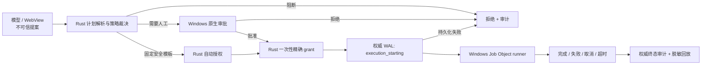
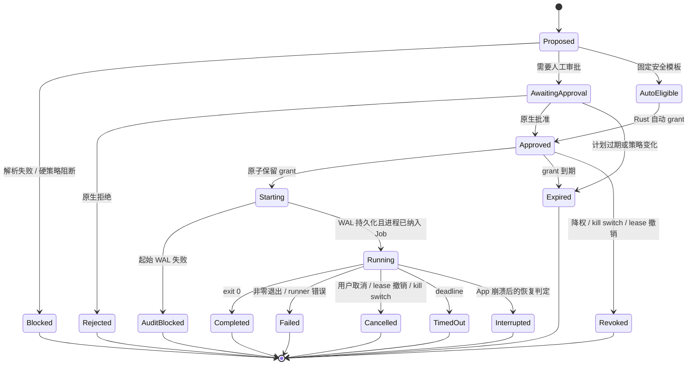

# Command Broker 可信审批与执行设计方案 v0.36

## 0. 文档状态

| 项目     | 值                                                                           |
| -------- | ---------------------------------------------------------------------------- |
| 状态     | Proposed；安全模型已由项目负责人于 2026-07-18 确认，代码尚未按本方案全部完成 |
| 目标版本 | v0.36 Arbitrary Shell / Command Broker                                       |
| 首发平台 | Windows 11；保持 Windows 10 兼容设计                                         |
| 决策主题 | 本地优先、人工与自动审批、可审计的任意命令执行                               |
| 安全权威 | Rust/Tauri 后端                                                              |
| 默认策略 | 拒绝优先、审计失败则不启动、授权精确且一次性                                 |

本文是 v0.36 Command Broker 的权威安全与工程基线。实现、测试、发布清单与其他文档若和本文冲突，以本文为准。

本文明确取代下列文档中“不可信前端可参与授权”“工作区 JSON lease 可作为权限凭证”“仅限制 cwd 即可称为工作区沙箱”“调用方提交完整执行请求即可启动进程”等旧假设，但保留其中不冲突的产品背景、分类器、回放界面和测试资产：

- `docs/adr/0012-arbitrary-shell-command-broker.md`
- `docs/arbitrary-shell-command-broker-threat-model-v0.35.md`
- `docs/arbitrary-shell-command-broker-implementation-gate-v0.35.md`
- `docs/app-command-broker-server-authorization-v0.36.md`
- `docs/permission-lease-lifecycle-v0.36.md`
- `docs/workspace-file-read-lane-v0.36.md`
- `docs/workspace-settings-persistence-v0.36.md`
- `docs/p1n-arbitrary-shell-command-broker-roadmap.md`
- `docs/v0.36-arbitrary-shell-command-broker-prompts.md`

这些旧文档在迁移完成前属于历史实现说明，不得单独作为发布依据。

## 1. 产品目标

v0.36 要把 DeepSeek Workbench 的 Command Broker 从“前端生成审批材料、后端复核部分字段后执行”升级为真正的本地可信执行边界：

1. 模型、WebView 和工作区内容可以提出命令，但不能批准命令。
2. 人工审批由 Rust 后端发起并由 Windows 原生界面完成。
3. 自动审批只适用于后端拥有的、版本化的固定安全模板。
4. 任意命令在执行前必须形成不可变计划，并获得与该计划精确绑定的一次性授权。
5. Full Access 不是永久开关，而是原生确认后发放的短时、可撤销、不可跨重启恢复的本地 lease。
6. 每次尝试都先写权威审计记录，再启动进程；审计不可用时拒绝执行。
7. Windows 子进程树可超时、可取消、可完整终止，stdout/stderr 不得导致死锁或无界内存增长。
8. 首个可发布版本对能力边界作诚实描述：任意本机进程不是工作区沙箱，也没有默认的网络隔离。

### 1.1 非目标

v0.36 不承诺：

- 对任意 Win32 程序提供文件系统沙箱；
- 仅凭 `cwd` 防止命令读写工作区之外的路径；
- 对任意进程提供可靠的单进程断网；
- 抵御已控制当前 Windows 用户账户、Rust 进程或内核的攻击者；
- 在后台长期运行守护进程；
- 跨 App 重启恢复 Full Access lease；
- 自动批准工作区脚本、`cargo build/test`、`npm/pnpm` 脚本、解释器代码或用户提供的可执行文件。

AppContainer、受限令牌、Windows Sandbox/虚拟机和按进程网络隔离属于后续独立里程碑，不能用尚未实现的标签代替。

## 2. 当前实现差距

当前未提交实现已经具备命令分类、策略规划、Tauri 调用、摘要回放和部分服务端复核，但仍存在必须在发布前关闭的关键缺口：

| 等级 | 当前缺口                                                 | v0.36 决策                                      |
| ---- | -------------------------------------------------------- | ----------------------------------------------- |
| P0   | 审批 receipt 由 WebView 构造，哈希和字段均可由调用方重算 | receipt 不再是授权凭证；批准状态只存在于 Rust   |
| P0   | `shellKind: none` 可令 `argv[0]` 指向任意程序            | 后端解析绝对路径并冻结；自动模式禁止用户程序    |
| P0   | 文件读取信任调用方提交的 permission mode                 | 模式和敏感路径决策改为 Rust 权威状态            |
| P1   | workspace lease JSON 位于工作区内，可编辑、复制或重放    | 旧 lease 不再授权；v0.36 lease 仅驻留 Rust 内存 |
| P1   | 过期时间通过字符串启发式判断                             | 授权 TTL 使用 `std::time::Instant`              |
| P1   | 只终止父进程，取消接口没有真实进程树控制                 | Windows Job Object 管理完整进程树               |
| P1   | 退出后才读取管道，可能死锁；输出无强边界                 | 启动即并发排空，限制保留量并持续丢弃超额字节    |
| P1   | 环境几乎继承宿主，shell 通过不可信 PATH 查找             | 绝对可执行路径、最小环境、受控 PATH             |
| P1   | 执行后才写工作区 transcript，摘要事件可能根本未落盘      | App 本地权威 WAL 必须先于进程创建               |
| P1   | `allowNetwork: false` 只是声明，没有 OS 强制             | 改为诚实的能力标记；无隔离时不得声称断网        |
| P1   | TS 与 Rust 分类规则可漂移                                | Rust 作最终裁决，共享 fixture 验证跨层一致性    |

在这些 P0 缺口关闭前，当前 `execute_command_broker_request` 不得作为可发布的任意命令执行入口。

## 3. 信任边界

### 3.1 不可信输入

以下对象始终按敌对输入处理，即使它们来自本机：

- DeepSeek 或其他模型输出；
- Tauri WebView、React 状态、浏览器存储和前端生成的 receipt；
- IPC 请求中的 mode、lease、分类、风险、workspace ref、kill switch 等字段；
- 工作区内的源码、脚本、可执行文件、`.git/config`、junction、symlink 和配置文件；
- 命令 stdout/stderr；
- 工作区内 `.deepseek-workbench` 的任何文件；
- 从旧版本迁移的 lease、settings、transcript 和 replay 数据。

### 3.2 可信计算基

v0.36 的可信计算基限定为：

- 已签名或受发布流程保护的 DeepSeek Workbench Rust/Tauri 后端；
- Rust 内存中的 `BrokerState`；
- Rust 直接创建的 Windows 原生审批对话框；
- Windows 提供的进程、文件句柄、Job Object、DPAPI 与当前用户 ACL；
- App 自有的 `%LOCALAPPDATA%` 审计目录和经 DPAPI 保护的完整性密钥；
- 经后端验证并冻结的策略、模板目录和可执行文件身份。

React UI 可以显示状态和发起请求，但不是可信计算基。

### 3.3 攻击边界

本方案主要防御：

- 被提示注入控制的模型或 WebView；
- 工作区恶意代码和配置；
- receipt/lease 重放、修改、伪造和跨工作区复用；
- 审批后替换命令；
- PATH、cwd、环境变量、junction/reparse point 劫持；
- 子进程逃离父进程超时/取消；
- 输出洪泛、管道死锁和审计缺失；
- 崩溃后把“已启动但无结束记录”误报为成功。

本方案不防御已经获得当前 Windows 用户同等权限并能注入 Rust 进程、读取其内存或替换安装文件的攻击者。发布签名、安装目录 ACL 与更新链安全由发布里程碑另行保证。

## 4. 不可妥协的安全不变量

实现和测试必须持续满足以下不变量：

1. **前端只提案，不授权。** WebView 提交的 `approved`、receipt、mode、lease、risk、classifier 和 workspace ref 永远不能直接增加权限。
2. **执行只引用后端计划。** 执行 IPC 只接受 `planId`；不得再次接受命令、参数、cwd 或模式。
3. **批准对象不可变。** 用户看到和批准的是 Rust 内存中冻结计划的精确内容；批准后任何字段改变都必须生成新计划并重新审批。
4. **授权精确且一次性。** grant 绑定计划哈希、工作区身份、策略版本和短 TTL，并在启动事务中原子消费。
5. **模式由后端持有。** 前端设置只是偏好；当前有效 mode、kill switch、lease 和策略版本均来自 `BrokerState`。
6. **自动审批没有任意输入。** 自动路径只能使用后端版本化模板，不能接收 shell 文本、任意 argv、用户可执行文件或工作区脚本。
7. **先审计，后启动。** `execution_starting` 权威记录持久化失败时，不得创建子进程。
8. **取消覆盖进程树。** 超时、用户取消、kill switch 和 App 退出均必须终止 Job Object 内的完整子进程树。
9. **不伪造隔离承诺。** 在没有 OS 沙箱时，不把 cwd、路径检查或策略标签描述成文件系统/网络隔离。
10. **拒绝优先。** 未知 mode、模板、分类、字段、状态转换、策略版本、路径身份或审计状态均 fail closed。
11. **敏感数据不进入摘要审计。** 命令展示可以是精确的，但持久摘要必须经过结构化脱敏；原始输出默认不持久化。
12. **不可绕过唯一入口。** 所有外部进程创建最终只能经过同一个 Rust runner；其他 Tauri command 不得自行 `Command::spawn`。

## 5. 权限模式

v0.36 保留现有产品模式名称以降低迁移成本，但重新定义其授权语义。

| 后端模式                  | UI 含义          | 固定安全模板                           | 任意命令                                                        | lease  |
| ------------------------- | ---------------- | -------------------------------------- | --------------------------------------------------------------- | ------ |
| `read_only_preview`       | 只读预览         | 不启动外部进程；只允许后端内部只读能力 | 禁止                                                            | 无     |
| `approval_mode`           | 每次询问         | 每次原生审批                           | 符合硬策略时每次原生审批                                        | 无     |
| `autonomous_safe_mode`    | 安全操作自动     | 自动执行                               | 禁止；用户可切到审批或高级模式后重新提案                        | 无     |
| `advanced_workspace_mode` | 高级工作区       | 自动执行                               | 每条命令原生审批                                                | 无     |
| `full_access_mode`        | 短时 Full Access | 自动执行                               | 有效 lease 内由后端生成一次性 grant；高影响命令仍可强制再次确认 | 必需   |
| `break_glass_mode`        | Break Glass      | 禁止                                   | v0.36 禁止                                                      | 不发行 |

### 5.1 `approval_mode`

- 每一次外部进程启动都显示 Rust 创建的 Windows 原生审批。
- 可批准直接 argv 或 shell 命令，但硬阻断规则仍生效。
- 适合希望逐条确认的默认保守工作流。

### 5.2 `autonomous_safe_mode`

- 只自动运行后端内置、固定参数、版本化且经过威胁审查的模板。
- v0.36 初始模板目录应保持极小；工作区构建、测试和包管理命令不属于“安全”，因为它们可以执行工作区代码、下载依赖或写入大量文件。
- 非模板命令不是“自动失败后偷偷降级执行”，而是明确阻断并提示切换到审批模式或高级模式。

### 5.3 `advanced_workspace_mode`

- 固定安全模板可自动运行。
- 任意 shell、任意程序和工作区脚本必须逐条原生审批。
- “Workspace”只表示默认 cwd、计划归属和审计范围，不表示进程被限制在该目录。
- 对递归删除、凭据访问、权限变更、持久化、驱动器根操作等高影响能力可硬阻断或显示加强确认。

### 5.4 `full_access_mode`

- 进入该模式必须经过 Rust 原生确认，随后发行默认 15 分钟、最长 30 分钟的绝对到期 lease。
- lease 不滑动续期、不写入工作区、不暴露为前端 bearer token、不跨 App 重启恢复。
- 每条命令仍由 Rust 冻结计划并生成精确的一次性 grant；lease 只替代多数逐条 UI 确认，不替代计划、策略、审计和进程隔离。
- 高影响类别可以按策略强制逐条原生确认，例如驱动器级删除、凭据导出、防火墙/账户/服务修改、关闭审计或自我更新链修改。
- 用户撤销 lease、切换模式、打开 kill switch 或 App 退出时，立即拒绝新计划并终止由该 lease 启动的活动 Job。

### 5.5 模式切换

- 降权立即生效，不需要确认。
- 切换到 `advanced_workspace_mode` 或 `full_access_mode` 必须由 Rust 展示原生确认。
- 前端可请求切换，但不能提交“已确认”的证明。
- 工作区 settings 只保存希望的 UI 默认值；App 启动时后端重新建立有效模式，默认回到 `approval_mode`，Full Access 永不自动恢复。

## 6. 总体架构

建议把当前大型 `commands.rs` 中的执行权限拆成独立 Rust 模块：

```text
app/src-tauri/src/
  command_broker/
    mod.rs
    ipc.rs                 # Tauri DTO 与最薄适配层
    state.rs               # BrokerState 与状态转换
    workspace.rs           # 工作区注册、句柄身份、路径复核
    policy.rs              # Rust 权威策略、模板与硬阻断
    plan.rs                # 命令解析、规范化、冻结、哈希
    approval.rs            # Windows 原生审批
    grant.rs               # 一次性 grant 与 Full Access lease
    audit.rs               # App 本地 WAL、哈希链、恢复
    redaction.rs           # 命令/环境/输出摘要脱敏
    runner/
      mod.rs
      windows.rs           # CreateProcessW、Job Object、管道、取消
```

前端 TypeScript 模块继续负责提案编辑、风险解释、状态展示和 replay projection，但 Rust 的结果是最终裁决。

### 6.1 `BrokerState`

Tauri 启动时通过 `.manage(BrokerState::new(...))` 注入全局状态。建议结构如下：

```rust
struct BrokerState {
    inner: Mutex<BrokerStateInner>,
    audit: AuditStore,
    policy: Arc<CompiledBrokerPolicy>,
    runner: Arc<dyn CommandRunner>,
}

struct BrokerStateInner {
    workspaces: HashMap<WorkspaceId, WorkspaceRegistration>,
    plans: HashMap<PlanId, FrozenCommandPlan>,
    approvals: HashMap<PlanId, ApprovalGrant>,
    leases: HashMap<LeaseId, FullAccessLease>,
    jobs: HashMap<JobId, ActiveJob>,
    effective_modes: HashMap<WorkspaceId, PermissionMode>,
    kill_switch_active: bool,
    audit_health: AuditHealth,
}
```

锁内只执行短状态转换；原生对话框、磁盘 I/O 和进程等待不得长时间持有全局锁。需要通过带版本号的快照和比较后提交，避免审批期间状态被替换。

### 6.2 责任流



## 7. 核心数据模型

下列结构是语义要求，不强制字段名称完全一致。

### 7.1 `WorkspaceIdentity`

```rust
struct WorkspaceIdentity {
    workspace_id: WorkspaceId,       // 随机 256-bit，不由路径推导
    canonical_display_path: PathBuf, // 只用于本机展示
    final_path: PathBuf,             // 句柄解析后的规范路径
    volume_serial: u64,
    file_id: [u8; 16],
    registered_at: SystemTime,
}
```

- `workspace_id` 由后端生成，前端只能引用。
- 授权绑定 `volume_serial + file_id`，不能只绑定可变字符串路径。
- 审计对外默认记录 workspace ID 和路径的脱敏摘要；完整路径只在本机受保护视图按需显示。

### 7.2 `FrozenCommandPlan`

```rust
struct FrozenCommandPlan {
    plan_id: PlanId,
    workspace_id: WorkspaceId,
    workspace_identity: WorkspaceIdentitySnapshot,
    mode_at_creation: PermissionMode,
    policy_version: PolicyVersion,
    template_id: Option<TemplateId>,
    executable: FrozenExecutable,
    argv: Vec<OsString>,
    shell_text: Option<OsString>,
    cwd: FrozenDirectory,
    environment: BTreeMap<OsString, OsString>,
    capabilities: CapabilitySet,
    classification: Classification,
    limits: ExecutionLimits,
    canonical_plan_hash: [u8; 32],
    created_at_utc: SystemTime,
    expires_at_monotonic: Instant,
}
```

- 哈希使用版本化的确定性编码和 SHA-256，用于绑定和审计，不作为前端可验证授权。
- `executable` 和 `cwd` 都保存句柄身份或可复核文件身份。
- `argv` 与 `shell_text` 互斥；shell 文本按原样冻结，不在批准后再次拼接。
- 环境是完整最终环境，而不是“在继承环境上打补丁”。
- 计划默认 5 分钟到期；策略变化、workspace 重注册、mode 降权或 kill switch 会使计划立即失效。

### 7.3 `ApprovalGrant`

```rust
struct ApprovalGrant {
    grant_id: GrantId,
    plan_id: PlanId,
    plan_hash: [u8; 32],
    workspace_identity: WorkspaceIdentitySnapshot,
    policy_version: PolicyVersion,
    source: GrantSource,
    issued_at_utc: SystemTime,
    expires_at_monotonic: Instant,
    state: GrantState, // Available | Reserved | Consumed | Revoked | Expired
}
```

- `grant_id` 使用 CSPRNG 生成，至少 256 bit。
- grant 默认 60 秒到期且只能使用一次。
- 前端不需要获得 grant token。`execute_command_plan(planId)` 在 Rust 内查找并原子消费对应 grant。
- 如果 `execution_starting` WAL 失败，grant 进入 `Consumed` 或 `Revoked`，不得原样重试；用户需重新批准。

### 7.4 `FullAccessLease`

```rust
struct FullAccessLease {
    lease_id: LeaseId,
    workspace_identity: WorkspaceIdentitySnapshot,
    issued_by_native_confirmation: bool,
    issued_at_utc: SystemTime,
    expires_at_monotonic: Instant,
    capabilities: CapabilitySet,
    revoked: bool,
}
```

- v0.36 的权威 lease 只存在于 Rust 进程内存。
- 工作区中的旧 lease JSON 可以迁移为非权威历史记录，但不能恢复权限。
- 审计只记录 lease 生命周期摘要；App 重启后记录 `lease_invalidated_on_restart`。
- 如未来必须跨重启持久化，应另做 ADR，并至少使用 App 本地目录、当前用户 ACL、DPAPI 机密和 HMAC 绑定；不能复用工作区 JSON。

### 7.5 `ActiveJob`

活动 Job 至少绑定：

- `job_id`、`plan_id`、`workspace_id`、`grant_id` 或 `lease_id`；
- Windows Job Object handle；
- 根进程与线程 handle；
- 取消 token、deadline 和输出计数；
- 当前状态与最后成功写入的审计序号。

## 8. IPC 设计

### 8.1 新命令

| Tauri command                    | 不可信输入                           | 后端行为                                             |
| -------------------------------- | ------------------------------------ | ---------------------------------------------------- |
| `select_and_register_workspace`  | 可选初始目录提示                     | 原生目录选择、句柄身份验证、返回 opaque workspace ID |
| `register_workspace_candidate`   | 路径候选                             | 只注册经过验证的身份，不因此授予执行权               |
| `request_permission_mode_change` | workspace ID、目标 mode              | Rust 策略判断；升权显示原生确认                      |
| `create_command_plan`            | workspace ID、命令提案或 template ID | 解析、重分类、冻结、返回只读摘要和 plan ID           |
| `request_command_approval`       | plan ID                              | 后端取回冻结计划并显示原生审批                       |
| `execute_command_plan`           | plan ID                              | 原子验证/消费 grant，先写 WAL，再启动                |
| `cancel_command_execution`       | job ID                               | 后端校验归属并终止 Job Object                        |
| `set_broker_kill_switch`         | 期望状态                             | 开启立即生效并终止活动 Job；关闭可要求原生确认       |
| `issue_full_access_lease`        | workspace ID、请求时长               | 原生确认后按后端上限发行                             |
| `revoke_full_access_lease`       | workspace ID                         | Rust 撤销并终止关联 Job                              |
| `get_broker_snapshot`            | workspace ID                         | 返回脱敏的权威状态                                   |
| `list_command_audit_events`      | workspace ID、分页游标               | 读取并验证权威审计链，返回摘要                       |

所有 DTO 使用 `#[serde(deny_unknown_fields)]`；Tauri camelCase 映射有契约测试。未知字段、枚举和 schema version 被拒绝，而不是静默忽略。

### 8.2 废止入口

- `execute_command_broker_request`：立即改为 fail closed 或仅在测试 feature 下使用，随后删除。
- 客户端 `approval_receipt`：保留为历史 replay 数据类型，不再作为执行授权。
- 客户端 `session_lease_ref`、`permission_mode`、`classifier_categories`、`kill_switch_active`：从执行请求移除。
- `issue_permission_lease` 及工作区 lease 文件：不再授予权限。
- 文件读取入口中的客户端 mode/receipt：迁移到同一个 `BrokerState` 决策和后端审批模型。

### 8.3 响应最小化

IPC 不返回：

- bearer grant/lease secret；-完整宿主环境；
- DPAPI/HMAC 密钥；
- Windows handle 或绝对审计存储路径；
- 未脱敏的持久审计内容。

前端获得的是 plan/job/workspace opaque ID、可展示摘要、状态、错误码和脱敏事件。

## 9. 计划与审批状态机



关键事务边界：

1. 锁内核对 plan、mode、workspace、policy、kill switch、grant/lease 和 TTL。
2. 将 grant 从 `Available` 原子改为 `Reserved`，创建 job ID。
3. 锁外同步持久化 `execution_starting` WAL。
4. WAL 失败：锁内终结为 `AuditBlocked`，消费 grant，返回错误，不调用 `CreateProcessW`。
5. WAL 成功：创建 suspended 进程、纳入 Job Object、启动输出读取，再 resume。
6. 记录 `execution_started`；如果进程创建失败，记录 `execution_failed_to_start`。
7. 终态先确定并终止/等待所有进程，再持久化唯一终态事件。

## 10. Windows 工作区与路径身份

### 10.1 注册

工作区注册使用目录 handle，而不是只对字符串调用 `canonicalize`：

1. 通过 Rust 发起的原生目录选择或验证候选路径。
2. 使用 `CreateFileW(FILE_FLAG_BACKUP_SEMANTICS | FILE_FLAG_OPEN_REPARSE_POINT)` 打开根目录。
3. 检查文件类型、ACL 可访问性和 reparse 属性。
4. v0.36 默认拒绝以 junction/symlink/reparse point 作为工作区根。
5. 用 `GetFinalPathNameByHandleW` 获得最终路径。
6. 用 `GetFileInformationByHandleEx(FileIdInfo)` 取得 volume serial 和 128-bit file ID。
7. 拒绝驱动器根、Windows 目录、Program Files、用户 profile 根、临时目录根和 App 自有审计目录。
8. 后端生成随机 workspace ID 并保存身份。

### 10.2 执行前复核

每次执行前重新打开 cwd 和可执行文件并比较冻结身份。身份变化、路径消失或变成 reparse point时，原计划失效并要求重新提案。

相对 cwd 必须在注册根内解析，不能包含 NUL 或逃逸组件。路径前缀比较必须基于 Windows 规范路径/句柄身份，不能用大小写敏感字符串 `starts_with`。

### 10.3 边界声明

上述检查只能保证“启动时使用了用户确认的 workspace/cwd/executable”，不能阻止已启动进程访问 `C:\`、注册表、网络或其他用户可访问资源。UI、文档和审计都必须使用“workspace-associated”或“默认工作目录”，不得使用“workspace-sandboxed”。

## 11. 命令规范化与可执行文件解析

### 11.1 直接 argv

- `shellKind: none` 不再意味着“无需 shell 就安全”。
- 后端禁止通过当前目录搜索程序。
- 自动模板只使用后端编译或安装时登记的绝对路径。
- 人工审批路径可以接受显式绝对程序路径，或从受控 PATH 中解析后冻结最终绝对路径；实际展示的是解析结果，不是用户输入的短名称。
- 位于工作区、用户临时目录或用户可写脚本目录的可执行文件标记为 `user_controlled_executable`，不能自动批准。
- `.bat`、`.cmd`、`.ps1`、`.js`、`.py` 等解释器输入按 shell/解释器代码处理，不得伪装成普通 argv 模板。

### 11.2 shell

Windows 首发只允许后端明确支持的 shell：

- `%SystemRoot%\System32\cmd.exe`，固定使用 `/d /s /c`；
- `%SystemRoot%\System32\WindowsPowerShell\v1.0\powershell.exe`，固定使用 `-NoLogo -NoProfile -NonInteractive`；
- `pwsh.exe` 只有在后端从可信安装位置解析、冻结文件身份并明确展示后才可用。

不得调用裸名称 `cmd`、`powershell` 或 `pwsh`。`bash`/`sh`、Git Bash 和 WSL 属于后续适配；启用前要定义其 Windows/WSL 双重路径、环境和进程树边界。

命令含 NUL、不可见控制字符、异常双向文本标记或超过展示上限时默认阻断。原生审批必须以可见转义方式展示换行、制表符和控制字符，不能截断后仍允许批准。

### 11.3 环境

runner 先 `env_clear`，再构造最小最终环境。基础候选：

- `SystemRoot`、`WINDIR`、`COMSPEC`；
- 当前用户必要的 `TEMP`/`TMP`，但应使用 App 管理的独立临时目录；
- 受控且不含工作区/当前目录的 `PATH`；
- 按模板显式声明的少量变量。

默认不继承：

- API key、token、credential、proxy、cloud、SSH、Git credential 变量；
- `NODE_OPTIONS`、`PYTHONPATH`、`RUSTC_WRAPPER`、`CARGO_HOME` 重定向、PowerShell profile 相关变量；
- `GIT_*`、动态库/模块加载和解释器注入变量；
- 调用方提交的任意环境键值。

人工批准的计划若需要额外变量，必须由后端按名称与敏感度分类并在原生审批中显示“注入了哪些变量”；敏感值不回显、不写摘要。

## 12. 自动安全模板

模板不是命令前缀 allowlist，而是后端拥有的完整执行规范：

```rust
struct SafeCommandTemplate {
    id: TemplateId,
    version: u32,
    executable_identity: TrustedExecutableIdentity,
    argv_builder: fn(ValidatedTemplateInput) -> Vec<OsString>,
    cwd_policy: CwdPolicy,
    environment: FixedEnvironmentPolicy,
    capabilities: CapabilitySet,
    limits: ExecutionLimits,
    security_review: &'static str,
}
```

要求：

- 参数必须是窄类型，例如后端 workspace ID、受验证的相对路径或固定枚举，不能是自由 shell 字符串。
- 模板完整指定绝对 executable、argv、cwd、环境和资源限制。
- 任意模板变更都会提升 policy version，使旧计划和 grant 失效。
- 模板安全测试同时覆盖参数注入、PATH 劫持、repo config/hook、junction、网络和写入副作用。

v0.36 首个实现建议只自动批准后端内部文件元数据/只读索引能力，以及少量无需读取工作区的受信任系统诊断。以下命令不得因名称常见而自动批准：

- `cargo build/check/test/run`；
- `npm`、`pnpm`、`yarn` 的任何脚本或安装命令；
- `python`、`node`、PowerShell、cmd 的自由代码；
- 读取工作区配置的 Git 命令，除非单独证明不会触发 hook、fsmonitor、textconv、pager 或外部 helper；
- 工作区内可执行文件和脚本；
- 任何网络客户端或包管理器。

## 13. Windows 进程执行器

### 13.1 创建与 Job Object

为避免子进程在纳管前逃逸，建议使用 `windows` crate 直接实现：

1. 为 stdout/stderr 创建不可继承读端、仅子进程继承写端的 pipe。
2. 创建 Job Object，设置 `JOB_OBJECT_LIMIT_KILL_ON_JOB_CLOSE`，并配置 v0.36 的活动进程数、内存和 CPU/时间限制。
3. `CreateProcessW` 使用 `CREATE_SUSPENDED | CREATE_UNICODE_ENVIRONMENT | CREATE_NO_WINDOW` 和显式 handle list。
4. 立即 `AssignProcessToJobObject`。
5. 分配失败则终止尚未 resume 的进程并 fail closed。
6. 启动 stdout/stderr drain，再 `ResumeThread`。
7. 取消、超时、lease 撤销、kill switch 或 App 关闭时调用 `TerminateJobObject`，随后等待句柄收敛。

Windows 10/11 要做真实嵌套 Job 环境测试；不得使用 `CREATE_BREAKAWAY_FROM_JOB` 绕过宿主限制。

### 13.2 输出与反压

- stdout/stderr 从进程启动时并发读取，不能等 `wait` 后再 `read_to_end`。
- 每个流设置保留上限和总上限，例如默认各 4 MiB、总 8 MiB；具体值由策略配置并写入计划。
- 达到上限后继续排空但丢弃超额内容，记录 `truncated` 和丢弃字节数，避免子进程因 pipe 满而阻塞。
- IPC 增量事件有速率和帧大小限制；UI 变慢不能反压到子进程。
- 解码使用有损 UTF-8 或明确编码标记，原始字节不进入 JSON 摘要。
- v0.36 不支持脱离 App 生命周期的后台 Job。

### 13.3 取消与超时

- deadline 在计划中冻结，运行时使用单调时钟。
- `cancel_command_execution(jobId)` 必须幂等；重复取消返回当前终态。
- 终态只允许写一次。exit、timeout 和 cancel 竞争时，由 Rust 状态机决定唯一结果并保留原始 exit code 作为附加证据。
- App 正常退出先打开全局 kill switch、终止所有 Job、写终态，再关闭审计。
- App 崩溃时 Job handle 关闭触发 kill-on-close；下次启动把缺少终态的记录恢复为 `interrupted`。

### 13.4 网络语义

普通 Win32 子进程只要拥有当前用户网络能力，就可能联网。因此 v0.36：

- 不再使用 `allowNetwork: false` 表示已实现隔离；
- 计划记录 `network_isolation: none` 和 `network_potential: true/false/unknown`；
- 网络客户端、包管理器和自由解释器在非 Full Access 下至少要求原生审批或硬阻断；
- UI 在任意命令审批中明确提示“该进程可能访问当前用户可访问的文件和网络”。

真正断网需要 AppContainer/WFP/Windows Sandbox 等后续设计与独立验收。

## 14. 原生审批 UX

### 14.1 技术边界

审批由 Rust 直接调用 Windows `TaskDialogIndirect` 或等价的非 WebView 原生界面。不能用 React modal、DOM typed phrase、前端 receipt 或模型消息作为授权证明。

调用过程在专用线程上运行，避免阻塞 Tauri 主事件循环。对话框结果回到 Rust 后，要再次检查 plan 版本、mode、workspace identity、kill switch 和 TTL；审批期间发生变化则批准无效。

### 14.2 必须展示的内容

原生对话框必须展示：

- 已解析的绝对 executable；
- 精确 argv 或 shell 文本，控制字符可见转义且不截断；
- 最终 cwd 和工作区名称；
- 模式、授权来源、计划短哈希和到期时间；
- 文件写入、删除、网络可能、凭据读取、权限/服务/注册表修改等能力；
- 明确警告：当前版本不提供文件系统或网络沙箱；
- `运行一次` 与 `取消`；Full Access 另有单独的 lease 对话框。

高影响操作可要求第二次确认或固定短语，但短语由原生控件采集并由 Rust 验证。前端 typed phrase 只可作为教育性 UX，不得授权。

### 14.3 防视觉欺骗

- 拒绝 NUL 和不受支持控制字符。
- 可疑 Unicode bidi/零宽字符明确标记并默认阻断。
- 路径、参数和能力不可只显示摘要或省略号。
- 若内容超过原生界面可靠展示上限，应阻断并要求缩短/拆分命令，而不是批准隐藏内容。
- 原生窗口标题含固定产品名和“Rust 安全审批”，不采纳工作区自定义标题。

## 15. 权威审计

### 15.1 存储位置

权威审计位于 App 自有目录，例如：

```text
%LOCALAPPDATA%\DeepSeekWorkbench\audit\
  broker-events-v1.jsonl
  integrity-key.dpapi
  checkpoints\
```

工作区内 transcript/replay 只能作为可删除的导出镜像，不能反向恢复权限或证明审批。

### 15.2 完整性

- 首次启动用 CSPRNG 生成每安装实例密钥，经 Windows DPAPI `CryptProtectData` 保护后保存。
- 审计目录设置当前用户 ACL，拒绝从工作区路径重定向。
- 每条事件使用版本化 canonical JSON，包含前一条记录哈希，并以 HMAC-SHA-256 认证。
- 追加后执行 `flush` 和 Windows `FlushFileBuffers`；只有成功后才能启动进程。
- 定期生成经认证 checkpoint，避免每次启动必须无限回放。
- HMAC 提供针对工作区/WebView和意外编辑的篡改检测，不声称抵御已控制当前用户或 Rust 进程的攻击者。

### 15.3 事件

最小事件集合：

- `workspace_registered` / `workspace_rejected`；
- `mode_change_requested` / `mode_changed` / `mode_change_rejected`；
- `plan_created` / `plan_blocked` / `plan_expired`；
- `approval_requested` / `approval_granted` / `approval_rejected` / `grant_expired`；
- `lease_issued` / `lease_revoked` / `lease_expired` / `lease_invalidated_on_restart`；
- `execution_starting` / `execution_started` / `execution_failed_to_start`；
- `execution_completed` / `execution_failed` / `execution_cancelled` / `execution_timed_out` / `execution_interrupted`；
- `kill_switch_changed`；
- `audit_integrity_failed` / `audit_recovered`。

`execution_starting` 至少记录 plan hash、workspace identity 摘要、policy version、grant source、能力、限制和脱敏命令摘要。`execution_started` 记录 PID/Job ID 的本地摘要。终态记录 exit code、耗时、截断计数和输出摘要哈希。

### 15.4 隐私与 transcript

- 默认权威审计只保存摘要和哈希，不保存完整命令中的敏感值或原始输出。
- 结构化脱敏先于序列化，禁止只对最终 JSON 做脆弱正则替换。
- 环境变量只记录名称、来源和敏感度，不记录敏感值。
- 用户显式开启原始 transcript 时，应存入 App 本地独立加密存储，设置容量/保留期，并在 UI 说明风险；此能力不是 v0.36 P0 发布前置。
- replay UI 只消费后端验证过的事件；完整性失败时显示红色不可忽略状态且禁止新执行。

### 15.5 崩溃恢复

启动时验证 WAL 链并查找只有 `execution_starting/started` 而没有终态的 job：

1. 写入 `execution_interrupted` 恢复事件；
2. 不恢复 grant 或 lease；
3. 默认打开执行锁，直到完整性验证和恢复事件持久化成功；
4. 无法验证链时保持 fail closed，提供只读导出与修复指引，不能静默新建空审计覆盖证据。

终态事件写入失败时不能撤销已经发生的执行。后端应立即进入 audit-degraded/kill-switch 状态、终止仍在运行的 Job、缓存最小恢复证据，并在下一次成功写入时追加恢复记录。

## 16. 分类器与硬策略

TypeScript 分类器继续为 UI 提供即时解释，但 Rust 必须从冻结的 executable、argv、shell、cwd 和能力重新分类。

### 16.1 硬阻断示例

v0.36 非 Break Glass 情况下，策略可直接阻断：

- 修改或删除权威审计、完整性密钥、App 安装/更新链；
- 操作驱动器根、卷、分区、引导配置或批量擦除；
- 绕过 Job Object、启动脱离 App 生命周期的后台/计划任务/服务；
- 凭据导出、浏览器密钥库/Windows Credential Manager 批量读取；
- 禁用安全软件、防火墙、审计或系统恢复；
- 已知无法完整展示或规范化的命令。

具体规则必须有稳定错误码和共享 fixture，不依赖本地化错误字符串。

### 16.2 能力优先

策略不能只匹配命令文本。计划至少表达：

- 读/写/删除文件；
- 工作区外路径可能；
- 网络可能；
- 子进程/解释器/工作区程序；
- 注册表、服务、账户、权限和持久化；
- 凭据/秘密读取；
- 包安装、自更新和安全边界修改。

无法可靠判断时标记 `unknown_high_risk` 并提升审批或阻断。

## 17. 文件读取 lane 的统一迁移

Command Broker 的安全边界不能只修进程执行，同时保留可伪造 mode 的敏感文件读取后门。

- `read_workspace_file` 只接受 workspace ID 和经过规范化的相对路径提案。
- Rust 从 `BrokerState` 读取有效 mode，并用同一 workspace identity 解析文件。
- `.env`、SSH key、credential、token/cache 等敏感路径在 `read_only_preview`、`approval_mode`、`autonomous_safe_mode` 和 `advanced_workspace_mode` 下按后端策略阻断或原生审批。
- Full Access lease 可以扩大读取权限，但读取仍生成精确一次性 grant 和审计事件。
- symlink/junction/reparse point 必须通过 handle 复核，不能只做字符串前缀判断。
- 读取内容返回前继续做大小、二进制、编码和秘密泄漏限制。

## 18. 错误模型

公开错误码保持稳定、可测试且不泄露秘密，例如：

- `BROKER_DISABLED_UNTRUSTED_EXECUTOR`
- `BROKER_AUDIT_UNAVAILABLE`
- `BROKER_AUDIT_INTEGRITY_FAILED`
- `BROKER_WORKSPACE_IDENTITY_CHANGED`
- `BROKER_PLAN_EXPIRED`
- `BROKER_POLICY_CHANGED`
- `BROKER_APPROVAL_REQUIRED`
- `BROKER_APPROVAL_REJECTED`
- `BROKER_GRANT_MISSING`
- `BROKER_GRANT_CONSUMED`
- `BROKER_LEASE_EXPIRED`
- `BROKER_KILL_SWITCH_ACTIVE`
- `BROKER_EXECUTABLE_UNTRUSTED`
- `BROKER_COMMAND_HARD_BLOCKED`
- `BROKER_JOB_ASSIGNMENT_FAILED`
- `BROKER_OUTPUT_LIMIT_REACHED`

内部错误链可以进入本地受保护诊断，但 IPC 默认返回错误码、简短用户说明和 correlation ID。

## 19. 分阶段实施计划

### Phase 0：立即封闭不可信执行入口

- 将当前 `execute_command_broker_request` 改为默认 fail closed。
- 禁止工作区 lease JSON 授权。
- 敏感文件读取不再接受调用方 mode/receipt 自动放行。
- 增加 P0 回归测试，证明伪造 receipt/lease、`shellKind:none` 和客户端 mode 不可执行。

验收：即使 WebView 完全被控制，也不能通过现有 IPC 启动任意进程或读取敏感文件。

### Phase 1：Rust 权威状态、工作区与冻结计划

- 引入 `BrokerState`、后端 effective mode、kill switch 和 policy version。
- 实现 Windows workspace handle identity。
- 实现 `create_command_plan`、规范化、Rust 分类与 plan hash。
- 建立模板注册表，初始自动目录保持极小。

验收：执行请求只能引用 Rust 已知 plan；修改命令、cwd、workspace 或策略后旧 plan 失效。

### Phase 2：原生审批、grant 与 Full Access lease

- 实现 Windows 原生单次审批。
- 实现 60 秒一次性 grant 的原子状态转换。
- 实现 15 分钟默认、30 分钟上限的内存 lease 和撤销。
- 升权模式切换全部走原生确认。

验收：前端伪造所有旧 receipt/lease 字段仍不能授权；批准不可重放或跨 workspace 使用。

### Phase 3：Windows Job runner

- 使用绝对 shell/executable、最小环境和显式 handle list。
- suspended create → assign Job → drain pipes → resume。
- 实现真实取消、超时、kill switch、输出上限与 App 退出清理。
- runner 单元测试使用抽象接口，Windows 集成测试运行真实子进程树。

验收：子进程/孙进程不能在取消或超时后存活；输出洪泛不死锁、不无界增长。

### Phase 4：权威审计与 UI/IPC 迁移

- 实现 App 本地 DPAPI/HMAC WAL、先写后启动和崩溃恢复。
- 新 IPC 接入 App surface；旧 receipt 只用于历史展示。
- replay UI 显示权威状态、隔离限制、授权来源和完整性。
- 文件读取 lane 迁移到 `BrokerState`。

验收：起始审计失败时 PID 从未产生；篡改 WAL 会锁闭执行；App 崩溃后产生 interrupted 记录。

### Phase 5：Windows CI、安装与发布

- GitHub Actions `windows-latest` 执行 Rust、前端、边界和真实 runner 测试。
- 建立 Windows 10/11 手工 QA 矩阵，覆盖 PowerShell、cmd、长路径、Unicode、UAC、嵌套 Job 和 WebView2。
- 修正 Tauri identifier，启用并验证 MSI/NSIS bundle，生成签名/校验和/SBOM。
- 完成升级、回滚、审计数据迁移与卸载保留策略。

验收：所有 P0/P1 安全门禁通过后，才允许创建 v0.36 RC；不得以当前 debug executable 代替可发布安装包。

## 20. 验收测试矩阵

| 编号      | 场景                                      | 必须结果                                |
| --------- | ----------------------------------------- | --------------------------------------- |
| AUTH-001  | WebView 构造合法外观的旧 approval receipt | 拒绝；不会创建进程                      |
| AUTH-002  | 重放已消费 plan/grant                     | `BROKER_GRANT_CONSUMED`                 |
| AUTH-003  | grant 超过 60 秒                          | 过期且需重新审批                        |
| AUTH-004  | 批准后替换 argv、shell、cwd 或 env        | 无修改入口；新提案生成新 plan           |
| AUTH-005  | plan 跨 workspace ID 使用                 | 拒绝                                    |
| AUTH-006  | 前端声称 Full Access 但后端无 lease       | 拒绝                                    |
| AUTH-007  | App 重启后重放 lease ID                   | 拒绝                                    |
| AUTH-008  | 降权/撤销/kill switch 后执行旧 plan       | 拒绝并撤销关联 grant                    |
| AUTO-001  | 自动模式提交自由 shell 文本               | 阻断                                    |
| AUTO-002  | 自动模式令 `argv[0]` 指向工作区 exe       | 阻断                                    |
| AUTO-003  | 篡改模板参数尝试 shell 注入               | 参数验证失败                            |
| PATH-001  | 工作区根是 junction/reparse point         | 注册失败                                |
| PATH-002  | 批准后替换 cwd/executable                 | 身份变化，plan 失效                     |
| PATH-003  | 大小写、UNC、长路径和 `..` 绕过           | 规范化一致或拒绝                        |
| ENV-001   | 宿主含 API key/token/proxy 变量           | 子进程不可见                            |
| ENV-002   | PATH 前置工作区同名 `powershell.exe`      | 仍启动冻结的系统绝对路径                |
| RUN-001   | 父进程创建孙进程后超时                    | 整个 Job 终止                           |
| RUN-002   | 取消与正常退出竞争                        | 只有一个终态，接口幂等                  |
| RUN-003   | stdout/stderr 同时持续洪泛                | 不死锁；内存有界；标记截断              |
| RUN-004   | Job assignment 失败                       | suspended 进程被终止且不 resume         |
| RUN-005   | App 正常退出                              | 所有活动 Job 终止并审计                 |
| AUDIT-001 | 审计目录不可写                            | 不创建进程                              |
| AUDIT-002 | 修改历史 JSONL 字节                       | 完整性失败、执行锁闭                    |
| AUDIT-003 | 起始 WAL 后模拟 App 崩溃                  | 下次启动记录 interrupted，不恢复授权    |
| AUDIT-004 | 终态写入失败                              | 进入 degraded/kill-switch，保留恢复证据 |
| READ-001  | 调用方伪造 mode 读取 `.env`               | 后端按真实模式阻断/原生审批             |
| READ-002  | 敏感文件通过 symlink 指向工作区外         | handle 复核后阻断                       |
| IPC-001   | unknown field/enum/schema/camelCase 漂移  | fail closed，契约测试稳定               |
| DRIFT-001 | TS 与 Rust 分类共享 fixture               | Rust 结果为权威，差异使测试失败         |

此外继续执行现有：

- `pnpm typecheck`
- `pnpm lint`
- `pnpm test`
- `pnpm app:test`
- `cargo test`
- capability boundary、secret scan、artifact hygiene
- `tauri build --debug --no-bundle`
- RC 阶段的 release build、MSI/NSIS 安装/升级/卸载和 Windows 真实机手工 QA

## 21. 建议依赖与工程约束

尽量保持依赖少而可审计：

- `windows`：Task Dialog、文件身份、DPAPI、Job Object、CreateProcessW 和 FlushFileBuffers；
- `getrandom` 或 `rand_core`：opaque ID 与 HMAC key；
- `sha2` + `hmac`：计划哈希与审计链；
- `subtle`：常量时间比较完整性标签；
- `zeroize`：内存密钥生命周期；
- `tokio` 仅在明确采用异步 IPC/管道架构时引入；若直接使用 Win32 overlapped I/O 或受控 reader threads，可不为了单一功能扩大运行时。

每个新增依赖需要：

- 固定兼容版本并提交 lockfile；
- license 与维护状态检查；
- `cargo audit`/供应链检查纳入 CI；
- 禁止默认启用无关 feature；
- Windows 10 最低 API 与 MSVC toolchain 验证。

## 22. 发布门禁

v0.36 RC 必须同时满足：

1. Phase 0–4 全部完成，P0/P1 验收测试有直接证据。
2. 当前不可信 `execute_command_broker_request` 不可从生产 IPC 调用。
3. 没有客户端 receipt、mode、lease 或 risk 字段能提升权限。
4. Windows Job runner 的真实子进程树、输出洪泛、取消和超时测试通过。
5. 权威审计“先写后启动”、完整性失败锁闭和崩溃恢复测试通过。
6. UI 明确展示任意命令没有文件系统/网络沙箱。
7. Windows CI、Windows 10/11 手工 QA、安装/升级/卸载通过。
8. MSI/NSIS bundle、identifier、签名策略、校验和和 SBOM 完成。
9. 现有测试、lint、typecheck、边界、秘密和制品检查全绿。
10. 安全评审确认没有未关闭的 P0；未关闭 P1 必须阻止 RC，而不是只写 known issue。

## 23. 后续演进

v0.36 稳定后再分别评估：

- AppContainer/受限令牌的低权限 runner；
- Windows Sandbox 或轻量 VM 隔离的高风险 runner；
- WFP/防火墙规则或代理层的可验证网络策略；
- 受保护的跨重启 lease（默认仍不建议）；
- WSL/Git Bash/macOS/Linux runner；
- 签名模板包和策略热更新；
- 可验证导出的审计 bundle；
- 后台任务与 App 重启后的安全接管。

任何后续功能都不能弱化本文的不变量：前端只提案、Rust 才授权、精确一次性 grant、审计先于执行、未知状态拒绝。

## 24. 设计结论

v0.36 的核心不是“再校验一个 receipt”，而是彻底改变授权所有权：

- WebView 负责表达意图；
- Rust 冻结真实计划并拥有 mode、grant、lease、kill switch 与审计状态；
- Windows 原生界面证明用户确实批准了 Rust 展示的那一条命令；
- Job Object 让取消和超时覆盖完整进程树；
- App 本地完整性审计在进程启动前留下不可静默跳过的证据。

在此模型下，“任意命令执行”可以开放，但它被明确建模为本机高权限能力，而不是被 cwd 或前端 receipt 伪装成沙箱能力。这是 DeepSeek Workbench 可开源、可维护、可持续发布的最低可信基线。
