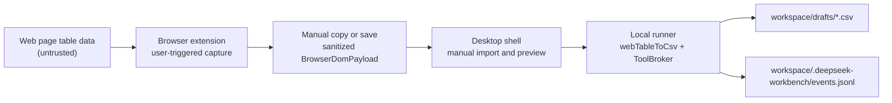
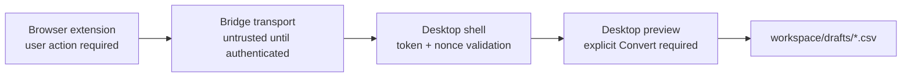

# Extension to Desktop Bridge Threat Model v0.1

This document models a future extension-to-desktop bridge for DeepSeek
Workbench. It is design-only: there is no Native Messaging host, localhost
server, custom protocol handler, auto-send, or automatic file write in v0.1.

## System Summary

Current flow:

Future bridge candidate:

## Assets

- **Workspace files:** local project or user workspace contents.
- **events.jsonl:** summary event log under
  `workspace/.deepseek-workbench/events.jsonl`.
- **Sanitized payload:** `BrowserDomPayload` produced by the extension.
- **Browser active tab data:** visible page table text and related page metadata.
- **Draft CSV output:** CSV drafts written under `workspace/drafts/`.
- **User trust and consent:** the user's expectation that capture, transfer,
  preview, and Convert are intentional.

## Trust Boundaries

- **Web page content is untrusted.** Table text, nearby text, captions, and page
  titles can contain prompt injection, formula injection, misleading labels, or
  private data.
- **The browser extension is trusted only after user action.** The extension can
  capture visible tables only after the user clicks; it must not auto-send or
  write files.
- **The desktop app is the local trusted boundary.** It validates payloads,
  previews data, calls the constrained local runner, and writes only under
  `workspace/drafts/`.
- **The bridge transport is untrusted until authenticated.** Native Messaging,
  localhost, a drop folder, or a protocol handler must prove freshness, pairing,
  and origin before the desktop accepts a payload.

## Attackers

- **Malicious web page:** attempts to place hostile data in table cells or page
  metadata.
- **Malicious extension impersonator:** tries to imitate the real extension or
  send forged payloads.
- **Local malware or local process:** attempts to call a bridge endpoint, write
  to a drop folder, or replay a prior transfer.
- **Replay attacker:** resubmits an old valid payload or token.
- **Payload tamperer:** modifies source metadata, table data, workspace hints,
  or redaction flags in transit.

## Threats and Mitigations

| Threat                           | Risk                                                      | Mitigations                                                                                                                  |
| -------------------------------- | --------------------------------------------------------- | ---------------------------------------------------------------------------------------------------------------------------- |
| Forged payload                   | Unauthorized data appears in desktop preview or drafts    | One-time pairing token, extension ID allowlist, payload signature or MAC in later phases, schema validation                  |
| Replayed payload                 | Old payload is accepted as new user intent                | Per-session nonce, token expiration, replay cache, event audit                                                               |
| Oversized payload DoS            | Desktop UI or runner is slowed or crashes                 | Payload size limit, max table/cell counts, streaming or early rejection                                                      |
| Extension sends without consent  | User loses control over active-tab data transfer          | User-triggered capture, visible preview, no background auto-send, no auto-write                                              |
| Endpoint abused by local process | Local process submits forged transfer                     | Bind to explicit session token, require nonce, reject unauthenticated local requests                                         |
| Workspace path manipulation      | Payload tries to influence write location                 | Desktop owns workspace selection; payload cannot set workspace; DraftWriter path guard writes only under `workspace/drafts/` |
| Full URL query leakage           | Sensitive query tokens appear in UI/events                | Strip query/hash before payload acceptance; event summaries use host/path only                                               |
| Raw DOM leakage                  | HTML, hidden inputs, or private DOM data crosses boundary | Reject `rawDom`, `innerHTML`, `outerHTML`; extension captures text abstraction only                                          |
| Automatic write without review   | Browser-origin data writes a local file without consent   | Desktop preview required; explicit Convert required; no auto-write                                                           |
| Prompt injection in table text   | Hostile text is treated as instruction                    | Treat all page data as untrusted; record warning counts and safe snippets only                                               |
| Formula injection in CSV         | Opening CSV triggers spreadsheet formula behavior         | Escape formula-like cells before writing CSV                                                                                 |
| Secret-like content in payload   | API keys or tokens are written or logged                  | Redaction and secret-like content rejection; event summaries omit raw payload and raw CSV                                    |

## Required Security Properties

- Bridge transfer must be initiated by explicit user action.
- Transfer token must be one-time, short-lived, and bound to a desktop session.
- Payload nonce must be fresh and rejected after use.
- Payload size must be capped before parsing into UI state.
- Payload must validate against the current `BrowserDomPayload` contract.
- Unsafe fields such as `rawDom`, `innerHTML`, `outerHTML`, password values,
  cookies, storage values, and full URL queries must be rejected or stripped.
- Desktop must show a preview before Convert.
- Convert must remain a user action.
- Draft writes must remain constrained to `workspace/drafts/`.
- Events must remain summary-only.
- Errors must be safe and must not include raw payload, raw CSV, API keys,
  Authorization headers, or environment variables.

## Candidate Transport Notes

### Native Messaging

Potentially strongest for browser-to-desktop identity because the browser can
bind messages to a registered host and extension ID. Risks are packaging,
installation, host registration, and accidental broadening of extension powers.

### Localhost Loopback HTTP

Easy to prototype, but any local process can attempt requests and web pages may
try to target loopback endpoints. It requires strict tokens, nonce freshness,
origin handling, method restrictions, and request size limits.

### Local File Drop Folder

Simple and offline, but vulnerable to local tampering, stale files, races, and
ambiguous user intent. It should not be treated as authenticated without extra
token binding.

### Custom Protocol

Useful for user-visible handoff but weak for large payload transport. It should
carry only a token or transfer reference, not raw payload content.

### QR or Copy-Token Pairing

Good as a pairing ceremony. It should be combined with a real transport and
should not bypass desktop preview or Convert confirmation.

## Recommended Route

1. **Phase E1: Design only.** Keep the manual handoff and document the model.
2. **Phase E2: Local bridge dry harness.** Use a fake client and fake transport
   to test token, nonce, payload validation, replay, and size behavior.
3. **Phase E3: Tokened payload proposal.** Let the extension generate a
   sanitized payload plus one-time token; desktop imports into preview only.
4. **Phase E4: Real bridge implementation.** Choose Native Messaging or
   localhost only after dry harness evidence exists.
5. **Phase E5: Optional auto-import.** Allow only preview population. Never
   auto-write drafts.

## Future Tests

- Forged token is rejected.
- Missing token is rejected.
- Stale nonce is rejected.
- Reused nonce is rejected.
- Oversized payload is rejected before UI parse.
- Payload with `rawDom` is rejected.
- Payload with `innerHTML` or `outerHTML` is rejected.
- Full URL query is stripped from summaries and events.
- Automatic Convert is blocked.
- Extension-origin mismatch is rejected.
- Local unauthenticated request is rejected.
- Event log contains no raw payload, raw CSV, raw DOM, API key, Authorization
  header, or full URL query.

## Explicit Non-goals

- No Native Messaging implementation.
- No localhost HTTP server.
- No custom protocol handler.
- No local drop-folder watcher.
- No extension auto-send.
- No extension file write.
- No desktop auto-Convert.
- No desktop action or browser automation.
- No MCP, shell automation, or UI automation.
- No real DeepSeek API call in the bridge path.
